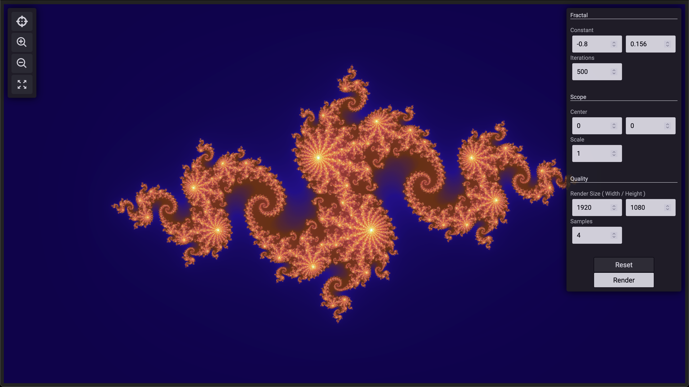

# fractal-explorer

## Architecture
- Docker Compose
- Nginx Reverse Proxy
- Go Web Server
- React Web Client

## Features
- Asyncronous/concurrent fractal rendering in client
- Image caching using a Docker volume

## Run the Application

### Development
To run the application in development mode, use command `make dev`. This will host the web server with live reload using Go Air, and will host the web client with live reload using Webpack dev server. Any changes made to the web client or web server while the application is running will be automatically included. Entrypoint to the application is `localhost:80`.

### Production
To run the application in production mode, use command `make run`. This will compile the web client into static files and will run the web server in production mode. Nginx hosts the web client files and directs server requests appropriately. Entrypoint to the application is `localhost:80`.